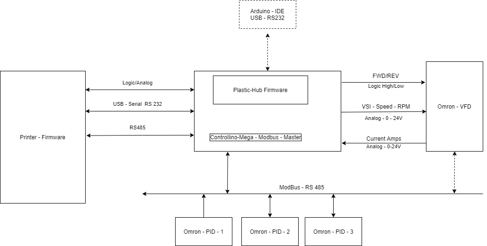
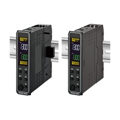
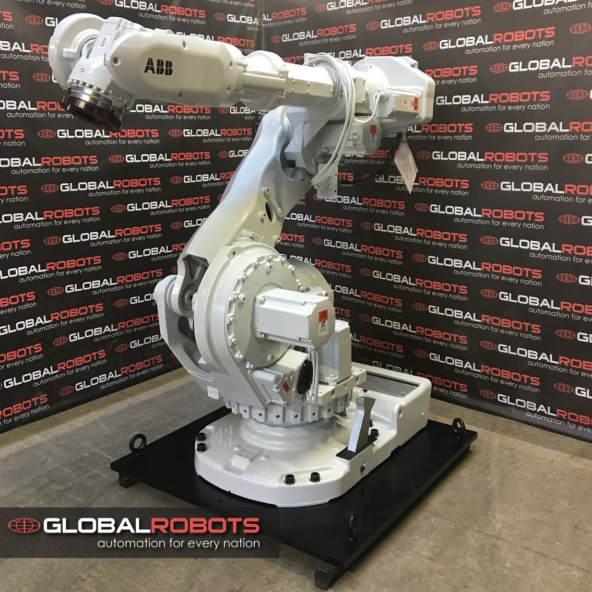

# lydia-print-head

Lydia-v4 as printhead

***brief*** this is part of our work of PP OpenSource contributions, please check our [library](https://library.precious-plastic.org/) or our [main page](https://plastic-hub.com/products/) for more.

This print head is a modification of [Lydia-v4](https://plastic-hub.com/products/lydia-v4.html) and aims at a generic solution for most of it´s components.

**Status** : Confirmed & in progress, ETA Mid. of October

## Todos

* [x] Hopper interface & lead-out -> Daniel
* [x] Motor selection
* [ ] Firmware updates
  + [x] Check TCP stack memory/CPU footprint on the ControllinoMega
* [x] Sensors / Audio, LED feedback (status, etc... )
* [ ] Bonus : test HMI
* [ ] Support [RAPID - ABB robots, but uses customer spec](https://library.e.abb.com/public/688894b98123f87bc1257cc50044e809/Technical%20reference%20manual_RAPID_3HAC16581-1_revJ_en.pdf)

### Todos Frederike@3dtreehouse

* [ ] Gantry mount plate, we need the size and locations of the mount holes. We'd need a test rig here.
* [x] Modbus over TCP seems a better fit after all which gives us CAT5 shielding as well some standard connectivity. RS485 has no real standard plugs, ...
* [ ] Location and size of the cabinet, what on the control panel (controls & plugs) ?
* [ ] We have to know how we share power source & ground among all digital circuits. Currently we're mostly at 24V and we need another source for 12V (fans, etc...)
* [ ] Clarify RAPID ethernet connectivity

### Todos TimberStar

* [x] we need a laser cut barrel shield which holds the insulation material
* [x] on the barrel tip, we need some mounting possibilties for fans which are a little heavy as well

## Components

* [x] [OMRON MX2 VFD](https://industrial.omron.es/es/products/3G3MX2-A2022-E) [BOM](https://es.wiautomation.com/omron/variadores-motores-proteccion-de-circuitos/3G3MX2A2022E?SubmitCurrency=1&id_currency=1&gclid=Cj0KCQjwy8f6BRC7ARIsAPIXOjgnGbRSd_DaX-o59wjtIBqI2mGllXWWOvjhSC1sPQgOTmGMvc7toncaAqejEALw_wcB)
* [x] Controllino - Mega as already mentioned a few times, adds 280 Euro
* [x] a better motor and gearbox - MotoVario
* [ ] custom firmware development
* [x] ModBus capable PID controllers (3x) : [Omron - E5DC-B](https://industrial.omron.eu/en/products/E5DC-QX2ASM-002) - Din - Rail Module [BOM](https://es.wiautomation.com/omron/plc-sistemas/E5DCQX2ASM002?SubmitCurrency=1&id_currency=1&gclid=Cj0KCQjwy8f6BRC7ARIsAPIXOjgWMeg-P2iN7wysDExpeHJHtEHAv06B2pKTz3DQlKjn67Al2K7YvvMaAs4IEALw_wcB)
* [Hopper - Linear Solenoid](https://uk.farnell.com/guardian-electric/t12x19-c-24d/solenoid-pull-operation-24vdc/dp/1608128?gclid=EAIaIQobChMIn4Xa8LPz6wIVEuntCh2SvwcDEAkYASABEgK3uvD_BwE&gross_price=true&mckv=s7TWt3nIG_dc%7Cpcrid%7C459864482330%7Cplid%7C%7Ckword%7C%7Cmatch%7C%7Cslid%7C%7Cproduct%7C1608128%7Cpgrid%7C114464711464%7Cptaid%7Cpla-323868377918%7C&CMP=KNC-GUK-SHOPPING-SMEC-Whoops-Newstructure-31Aug2020)

### Noah OS Variant

* [x] [PLC/Proxy for Aux, Sensors, Relays, etc... - CP1L-EM40DT1-D](http://www.ia.omron.com/products/family/1916/lineup.html), works well with [Omron NB NB3Q-TW01B](https://es.wiautomation.com/omron/hmi-pc-industriales/NB3QTW01B?SubmitCurrency=1&id_currency=1&gclid=CjwKCAjwh7H7BRBBEiwAPXjadt5G-53T-xJ8v5VmzdF5wUu8uHT1us-fzXU5913IwC3Kbz4cDg3jnBoC7g0QAvD_BwE)

# Status

* [Firmware](https://github.com/plastic-hub/hydra), in development but mostly done
* Hardware, in re-design

### Specs

* Voltage : 220V|380V
* Max. 120Kg, first rev. might be around 60KG
* Controller cable length around 20 meter
* PID : +/- 5 degc tolerance, alarm/cooling outputs

### Gantry Mount

* the gantry mount should be detached from the head-mount -> adapter plate
* @todo : run static tests
* the tool flange is on p30, ([see also ATI Toolchanger - YuTu](https://www.youtube.com/watch?v=kDP-oofDn4w&feature=youtu.be))

### Firmware

- [-] For now, we base all on Arduino based and existing PlasticHub firmware framework, in particular we will use [Controllino-Mega](https://www.controllino.biz/product/controllino-mega/) which gives us Ethernet and RS485. The board has been proven reliable and robust (ideal for prototyping).
- [-] VFD and PID control is mapped to Serial communication which might accept G-Code
- [x] VFD will be Omron-M2X series since we can use existing code. The VFD also supports Modbus (rather difficult)
- [ ] Internal registers/coils (custom PlasticHub Firmware) to Modbus rep

**[Diagram source](https://app.diagrams.net/#G1L7Prviy9U-2gpcZHm8Z5dj39gxDHd_V_)**

### PID Controller

* [ ] We should go for [Omron E5-C](https://assets.omron.com/m/6f7cd0d93654a7a4/original/E5_C-Temperature-Controller-to-NB-Screen-Template-Tech-Guide.pdf) series which come with Modbus (consider EMI and cable length to the main controller)
* [ ] Each PID will be exposed on the internal ModBus mapping
* There is currently a [custom PID controller](https://github.com/plastic-hub/pid-controller) in development but as mentioned, it's unlikely that it sees the light before November. However, I can imagine we use sub-routines as they're avaiable
* [ ] We should create logging module as well a an API to set temperature profiles for different materials. The logging module will help analyzing different PID settings as well experimenting with barrel cooling (when overshooting becomes an issue).
* [ ] Additional, we forward alarms for overshooting on the internal bus

* **Changes** :  Turns out that the [E5DC / E5DC-B](http://www.ia.omron.com/products/family/3242/) family is better choice.

### Barrel

* easy to shorten
* OD should be standard to EU heatbands
* Between Nozzel and barrel we might have some adaptery to exchange different screw tips, up to 10 cm
* should have a mount near the nozzle
* Barrel - motor flange should have some redunancy to enable different barrels

----

### Hopper interface and Hopper

* [-] Feed control ? -> waiting for the robot pictures
* [x] should have a thread interface

## Todos

* [x] Investigate Omron - PID feedback to enable more control via M/G codes (purge, ...)
* [x] Investigate GCode to ROS mapping
* [x] Investigate screw tip machining, if lucky we get away with 4 axis
* [-] Test different VFD/PID checksum/parity settings with larger EMI around

# References

## ROS

* [ROS - Github](https://github.com/ros-industrial)
* [ROS - GBRL - Github](https://github.com/openautomation/ROS-GRBL/wiki/GRBLtron)
* [ROS - Matlab|SimuLnk](https://www.mathworks.com/help/ros/ug/get-started-with-ros-in-simulink.html)
* [ROS Modbus - Wiki](http://wiki.ros.org/modbus)
* [ROS Modbus - PLC - Github](https://github.com/sonyccd/ros_plc_modbus)

## Related Projects

* [Project Noah](https://github.com/plastic-hub/noah)

### Cable robotics

- [The Cable-robot Analysis and Simulation Platform for Research (CASPR)](https://github.com/darwinlau/CASPR)
- [CUHK C3 Robotics Laboratory - Youtube](https://www.youtube.com/channel/UCxadDa3g1fUarP4ldAECtLQ)

### Rapid - ABB

* [Language specs and docs](./vendor/abb/2CSG445026D0201-ANR-LAN-Modbus-TCP-Protocol.pdf)
* [ABB - AC_800M - Protocols](./vendor/abb/3BSE035982-511_en_AC_800M_5.1_Feature_Pack_Communication_Protocols.pdf)

### ABB 6600

</img>

- [ABB - IRC - 5 - Controller](https://new.abb.com/products/robotics/controllers/irc5)
- [ABB - IRC - Datasheet](./vendor/abb/IRC5-Industrial-Robot-Controller-data sheet.PDF)
- [ABB irb 6600 175-2.8](https://library.e.abb.com/public/560fa420555c2d8ac1257b4b0052112c/3HAC023933-001_rev1_en.pdf)
- [ABB irb 6600 175 - 2.8 - Local](./vendor/abb/IRB_6600_R_US 02_05.pdf)
- [ABB 660 - Specs](./vendor/abb/ABB-IR-6600-3HAC14064-1_revH_en_library.pdf)

## Project links

* [Project Slack channel](https://pporgworkspace.slack.com/archives/C01A8G36MRP)
* [Firmware](https://github.com/plastic-hub/lydia-print-head/firmware)

## Follow ups

- [ ] calc. energy overhead, per printed kg of plastic
- [ ] calc. min. invest to print obvious products
- [ ] investigate possible OS verticals
- [ ] develop generic system & functional design for v2.0 candidats, for 6D robots but also cable driven 3D systems
- [ ] check displacement options for segmented prints, (cheap floor track system?)
